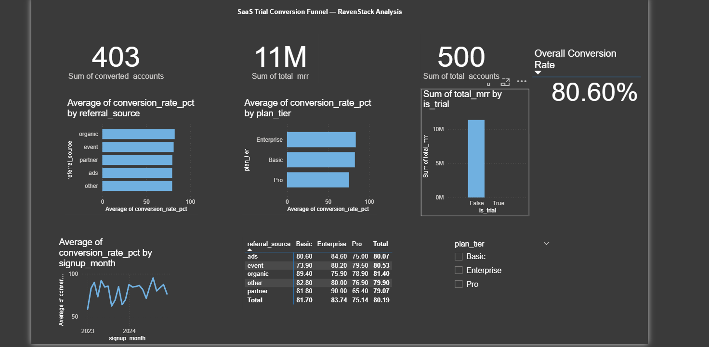

SaaS Trial Conversion Funnel Analysis
An end-to-end data analysis project examining what drives trial-to-paid
conversion for a SaaS product, using SQL for analysis and Power BI for
visualization.
Overview
This project analyzes 500 customer accounts and 5,000 associated
subscription records to answer a core SaaS growth question: which
customers convert from trial to paid, and why?
The analysis moves from raw data → SQL querying → dashboard → a written
business recommendation, mirroring the workflow of an actual analyst
task.
Tools used
MySQL — data modeling, cleaning, and analysis
Power BI — interactive dashboard
RavenStack dataset — synthetic SaaS data (accounts, subscriptions,
feature usage, support tickets, churn events)
Key findings
Plan tier drives conversion more than acquisition channel (Enterprise
83.8% vs. Pro 75.8%)
Pro-tier conversion is highly channel-dependent, ranging from 65.4%
(partner referrals) to 79.5% (event referrals)
Partner referrals convert best for Enterprise (90.0%) but worst for Pro
(65.4%) — a channel that looks "average" overall is actually polarized
by tier
Monthly conversion is volatile (58.8%–95.2%) with no clear long-term
trend
Paid subscriptions generate $11.3M in total MRR, averaging $2,686 per
account
Full analysis and recommendation: Findings.md
Files in this repo
File	Description
`analysis.sql`	Full SQL script: schema, data load, and 6 analysis queries
`Findings.md`	Business findings and recommendation
`dashboard.png`	Power BI dashboard preview
Dashboard preview

Dataset credit
Dataset: RavenStack (synthetic SaaS dataset) by River @ Rivalytics.
